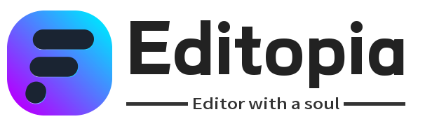

# Editopia - 给你不一样的编辑体验
 👏从现在起，立刻体验更强大的记事本！

您可以直接在版本列表下载已构建的版本程序：立即前往

**功能特色：**

------

- [x] 📜支持几乎所有的文件打开
- [x] 🌏更丰富的多语言支持
- [x] 📝丰富的编辑器功能
- [x] 💡主流配置文件和代码文本高亮
- [x] 🛡严格的隐私保护，除调用第三方服务外，不会以任何形式收集上传用户数据
- [x] 🎉开源！在遵循GPLv3协议的前提下，鼓励共同协作和二次开发

**交流/联系：**

------

**赞助：**

------

创作不易，如果您觉得这个项目给您带来的帮助，不妨支持一下吧~

赞助名单
